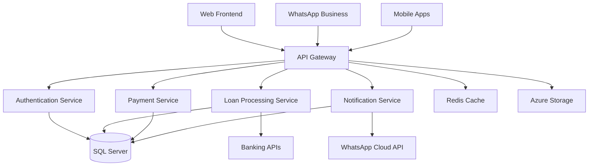

# 🏦 Ho Hema Loans Platform

A comprehensive loan automation platform for South African employees, featuring multi-channel applications through web portal and WhatsApp integration.

## 🚀 Quick Start

### Prerequisites
- **Node.js** 18.x or later
- **.NET** 8.0 SDK
- **Docker Desktop**
- **SQL Server** 2022 or Azure SQL Database

### Development Setup

1. **Clone the repository**
   ```bash
   git clone <repository-url>
   cd HoHema
   ```

2. **Install dependencies**
   ```bash
   ./scripts/setup/install-dependencies.sh
   ```

3. **Setup local database**
   ```bash
   ./scripts/setup/setup-database.sh
   ```

4. **Start development environment**
   ```bash
   docker-compose up -d
   ```

5. **Access the applications**
   - Frontend: http://localhost:5173
   - API: http://localhost:5000
   - API Documentation: http://localhost:5000/swagger

## 🏗️ Architecture

### Technology Stack

#### Frontend
- **React 18+** with TypeScript
- **Vite** for build tooling
- **Tailwind CSS** + Headless UI for styling
- **Zustand** for state management
- **TanStack Query** for API calls

#### Backend
- **ASP.NET Core 8.0** Web API
- **Entity Framework Core** for data access
- **JWT** authentication
- **Redis** for caching
- **Swagger** for API documentation

#### Database
- **Microsoft SQL Server 2022**
- **Entity Framework Core** migrations
- **Audit logging** and compliance tracking

#### External Integrations
- **Meta WhatsApp Business** Cloud API
- **South African banking** APIs
- **Azure Services** (Storage, Key Vault, Application Insights)

### System Architecture



## 🌟 Features

### Multi-Channel Access
- **Web Portal**: Full-featured responsive web application
- **WhatsApp**: Interactive flows for loan applications and account management
- **Mobile**: Progressive web app with offline capabilities

### Loan Products
- **Salary Advances**: Up to 80% of current month earnings
- **Short-term Loans**: Up to 25% of monthly salary

### Compliance & Security
- **NCR Compliance**: Full adherence to South African credit regulations
- **POPIA Compliance**: Data protection and privacy controls
- **Security**: JWT authentication, data encryption, audit trails

### Smart Processing
- **Automated Affordability**: Real-time earnings-based assessment
- **Digital Contracts**: OTP-based digital signature system
- **Payment Integration**: Direct bank account disbursements

## 📁 Project Structure

```
HoHema/
├── docs/                    # Documentation
├── src/
│   ├── frontend/           # React + TypeScript frontend
│   └── api/                # .NET Core Web API
├── deploy/                 # Docker & Azure configurations
├── tests/                  # Test suites
└── scripts/                # Utility scripts
```

See [PROJECT_STRUCTURE.md](PROJECT_STRUCTURE.md) for detailed structure.

## 🛠️ Development

### Running Locally

#### Frontend Development
```bash
cd src/frontend
npm install
npm run dev
```

#### Backend Development
```bash
cd src/api
dotnet restore
dotnet run --project HoHema.Api
```

#### Database Migrations
```bash
cd src/api/HoHema.Infrastructure
dotnet ef migrations add InitialCreate
dotnet ef database update
```

### Testing

#### Frontend Tests
```bash
cd src/frontend
npm run test
npm run test:e2e
```

#### Backend Tests
```bash
cd src/api
dotnet test
```

### Code Quality

#### Frontend Linting
```bash
cd src/frontend
npm run lint
npm run type-check
```

#### Backend Analysis
```bash
cd src/api
dotnet format
dotnet build --verbosity normal
```

## 🔧 Configuration

### Environment Variables

#### Frontend (.env)
```bash
VITE_API_URL=http://localhost:5000/api
VITE_WHATSAPP_NUMBER=+27123456789
VITE_APP_INSIGHTS_KEY=your-app-insights-key
```

#### Backend (appsettings.Development.json)
```json
{
  "ConnectionStrings": {
    "DefaultConnection": "Server=localhost;Database=HoHemaLoans;Trusted_Connection=true;"
  },
  "JwtSettings": {
    "SecretKey": "your-super-secret-key-here",
    "Issuer": "https://localhost:5000",
    "ExpiryMinutes": 60
  },
  "WhatsApp": {
    "AccessToken": "your-whatsapp-token",
    "WebhookVerifyToken": "your-webhook-token"
  }
}
```

## 📊 Monitoring & Logging

### Application Insights
- Performance monitoring
- Error tracking
- User analytics
- Custom telemetry

### Logging
- Structured logging with Serilog
- Audit trail for compliance
- Security event logging
- Performance metrics

## 🚀 Deployment

### Development
```bash
docker-compose up -d
```

### Staging/Production
See [deployment-guide.md](docs/deployment-guide.md) for comprehensive deployment instructions.

### Azure Resources
- App Service for API hosting
- Static Web Apps for frontend
- Azure SQL Database
- Redis Cache
- Key Vault for secrets
- Application Insights for monitoring

## 📋 Implementation Status

Track progress using our [Implementation Checklist](docs/implementation-checklist.md):

- [x] Phase 1: Foundation & Setup
- [ ] Phase 2: Core Infrastructure  
- [ ] Phase 3: User Authentication
- [ ] Phase 4: Loan Application System
- [ ] Phase 5: Contract & Agreement System
- [ ] Phase 6: Payment Processing
- [ ] Phase 7: WhatsApp Integration
- [ ] Phase 8: Admin Dashboard
- [ ] Phase 9: Testing & QA
- [ ] Phase 10: Deployment & Go-Live

## 🤝 Contributing

### Development Workflow
1. Create feature branch from `develop`
2. Implement changes with tests
3. Ensure all tests pass
4. Submit pull request for review
5. Merge to `develop` after approval

### Code Standards
- **TypeScript**: Strict mode enabled
- **C#**: Follow Microsoft coding conventions
- **Testing**: Minimum 80% code coverage
- **Security**: All inputs validated and sanitized

## 📞 Support

### Development Team
- **Project Manager**: [Name]
- **Lead Developer**: [Name]
- **DevOps Engineer**: [Name]
- **QA Engineer**: [Name]

### External Partners
- **WhatsApp Business**: Meta for Business support
- **Banking Integration**: [Bank partner] technical support
- **Legal Compliance**: [Legal firm] for NCR guidance

## 📄 License

This project is proprietary software owned by Ho Hema Loans. All rights reserved.

## 🔗 Related Documentation

- [Requirements Analysis](docs/requirements-analysis.md)
- [API Specifications](docs/api-specifications.md)
- [Database Schema](docs/database-schema.md)
- [Deployment Guide](docs/deployment-guide.md)
- [Implementation Checklist](docs/implementation-checklist.md)

---

**Built with ❤️ for South African employees**