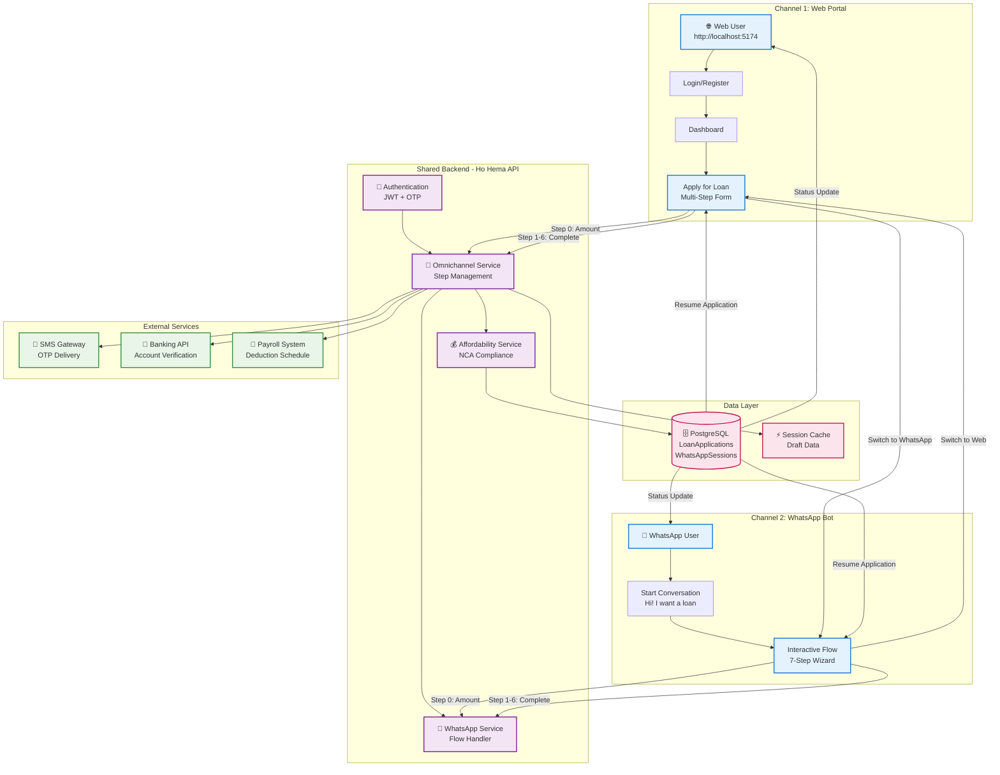
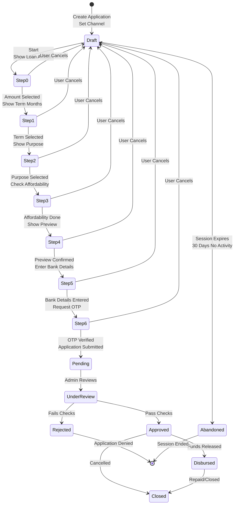
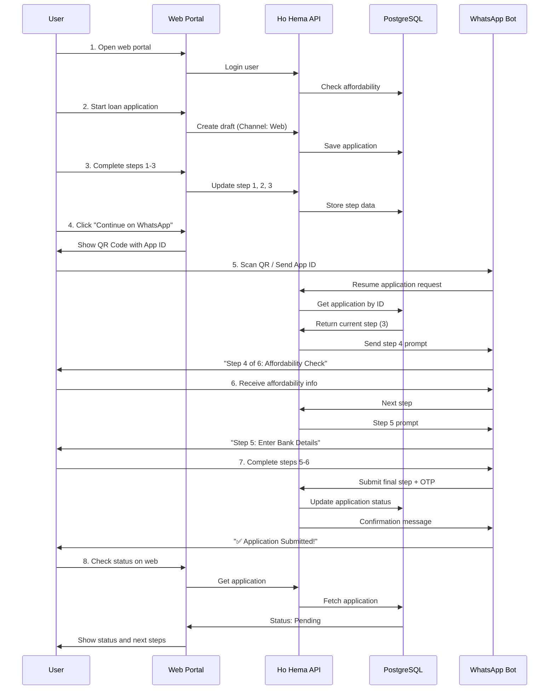
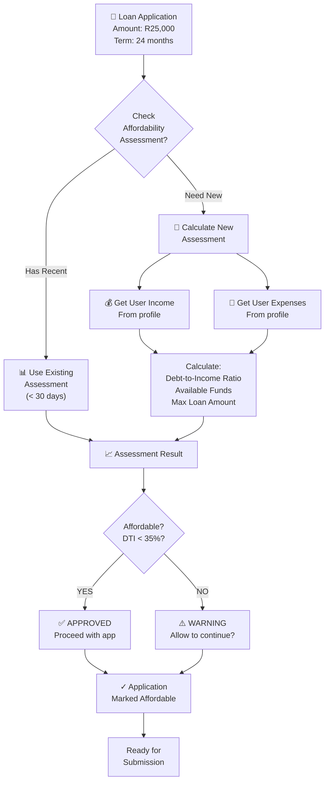

```mermaid
graph TB
    subgraph "Channel 1: Web Portal"
        WEB["🌐 Web User<br/>http://localhost:5174"]
        WLOG["Login/Register"]
        WDASH["Dashboard"]
        LOANFORM["Apply for Loan<br/>Multi-Step Form"]
        WEB --> WLOG --> WDASH --> LOANFORM
    end
    
    subgraph "Channel 2: WhatsApp Bot"
        WA["💬 WhatsApp User"]
        WAMENU["Start Conversation<br/>Hi! I want a loan"]
        WAFLOW["Interactive Flow<br/>7-Step Wizard"]
        WA --> WAMENU --> WAFLOW
    end
    
    subgraph "Shared Backend - Ho Hema API"
        AUTH["🔐 Authentication<br/>JWT + OTP"]
        OMNISVC["🔀 Omnichannel Service<br/>Step Management"]
        AFFORDSVC["💰 Affordability Service<br/>NCA Compliance"]
        WHATSAPPSVC["📱 WhatsApp Service<br/>Flow Handler"]
        
        AUTH --> OMNISVC
        OMNISVC --> AFFORDSVC
        OMNISVC --> WHATSAPPSVC
    end
    
    subgraph "Data Layer"
        DB[("🗄️ PostgreSQL<br/>LoanApplications<br/>WhatsAppSessions")]
        CACHE["⚡ Session Cache<br/>Draft Data"]
        
        AFFORDSVC --> DB
        OMNISVC --> CACHE
    end
    
    subgraph "External Services"
        SMS["📧 SMS Gateway<br/>OTP Delivery"]
        BANKING["🏦 Banking API<br/>Account Verification"]
        PAYROLL["💼 Payroll System<br/>Deduction Schedule"]
        
        OMNISVC --> SMS
        OMNISVC --> BANKING
        OMNISVC --> PAYROLL
    end
    
    %% Web Flow
    LOANFORM -->|Step 0: Amount| OMNISVC
    LOANFORM -->|Step 1-6: Complete| OMNISVC
    
    %% WhatsApp Flow
    WAFLOW -->|Step 0: Amount| WHATSAPPSVC
    WAFLOW -->|Step 1-6: Complete| WHATSAPPSVC
    
    %% Channel Switching
    LOANFORM -->|"Switch to WhatsApp"| WAFLOW
    WAFLOW -->|"Switch to Web"| LOANFORM
    
    %% Database Operations
    DB -->|"Resume Application"| LOANFORM
    DB -->|"Resume Application"| WAFLOW
    
    %% Notifications
    DB -->|"Status Update"| WEB
    DB -->|"Status Update"| WA
    
    %% Styling
    classDef channel fill:#e3f2fd,stroke:#1976d2,stroke-width:2px
    classDef service fill:#f3e5f5,stroke:#7b1fa2,stroke-width:2px
    classDef data fill:#fce4ec,stroke:#c2185b,stroke-width:2px
    classDef external fill:#e8f5e8,stroke:#388e3c,stroke-width:2px
    
    class WEB,WA,LOANFORM,WAFLOW channel
    class AUTH,OMNISVC,AFFORDSVC,WHATSAPPSVC service
    class DB,CACHE data
    class SMS,BANKING,PAYROLL external
```

## Application State Machine

```mermaid
stateDiagram-v2
    [*] --> Draft: Create Application<br/>Set Channel

    Draft --> Step0: Start<br/>Show Loan Amount
    
    Step0 --> Step1: Amount Selected<br/>Show Term Months
    
    Step1 --> Step2: Term Selected<br/>Show Purpose
    
    Step2 --> Step3: Purpose Selected<br/>Check Affordability
    
    Step3 --> Step4: Affordability Done<br/>Show Preview
    
    Step4 --> Step5: Preview Confirmed<br/>Enter Bank Details
    
    Step5 --> Step6: Bank Details Entered<br/>Request OTP
    
    Step6 --> Pending: OTP Verified<br/>Application Submitted
    
    Step0 --> Draft: User Cancels
    Step1 --> Draft: User Cancels
    Step2 --> Draft: User Cancels
    Step3 --> Draft: User Cancels
    Step4 --> Draft: User Cancels
    Step5 --> Draft: User Cancels
    Step6 --> Draft: User Cancels
    
    Draft --> Abandoned: Session Expires<br/>30 Days No Activity
    
    Pending --> UnderReview: Admin Reviews
    UnderReview --> Approved: Pass Checks
    UnderReview --> Rejected: Fails Checks
    
    Approved --> Disbursed: Funds Released
    Approved --> Closed: Cancelled
    Rejected --> [*]: Application Denied
    Disbursed --> Closed: Repaid/Closed
    Abandoned --> [*]: Session Ended
```

## Channel Switching Sequence

```mermaid
sequenceDiagram
    participant User
    participant Web as Web Portal
    participant API as Ho Hema API
    participant DB as PostgreSQL
    participant WA as WhatsApp Bot

    User->>Web: 1. Open web portal
    Web->>API: Login user
    API->>DB: Check affordability
    User->>Web: 2. Start loan application
    Web->>API: Create draft (Channel: Web)
    API->>DB: Save application
    User->>Web: 3. Complete steps 1-3
    Web->>API: Update step 1, 2, 3
    API->>DB: Store step data
    User->>Web: 4. Click "Continue on WhatsApp"
    Web->>User: Show QR Code with App ID
    
    User->>WA: 5. Scan QR / Send App ID
    WA->>API: Resume application request
    API->>DB: Get application by ID
    DB->>API: Return current step (3)
    API->>WA: Send step 4 prompt
    WA->>User: "Step 4 of 6: Affordability Check"
    
    User->>WA: 6. Receive affordability info
    WA->>API: Next step
    API->>WA: Step 5 prompt
    WA->>User: "Step 5: Enter Bank Details"
    
    User->>WA: 7. Complete steps 5-6
    WA->>API: Submit final step + OTP
    API->>DB: Update application status
    API->>WA: Confirmation message
    WA->>User: "✅ Application Submitted!"
    
    User->>Web: 8. Check status on web
    Web->>API: Get application
    API->>DB: Fetch application
    DB->>Web: Status: Pending
    Web->>User: Show status and next steps
```

## Data Flow - Complete Loan Application

```mermaid
graph LR
    A["👤 User Initiates<br/>App on Web or WA"] 
    B["📱 Select Channel<br/>Web/WhatsApp"]
    C["💾 Create Draft<br/>In Database"]
    D["📝 Enter Details<br/>Step by Step"]
    E["🧮 Calculate<br/>Affordability"]
    F["🏦 Get Bank Info<br/>Validate Account"]
    G["📋 Generate Contract<br/>With Terms"]
    H["🔐 OTP Verification<br/>Digital Sign"]
    I["✅ Submit<br/>Status: Pending"]
    J["📊 Admin Review<br/>Dashboard"]
    K["💰 Approve &<br/>Disburse"]
    L["📢 Notify User<br/>Both Channels"]
    
    A --> B --> C --> D --> E
    E --> F --> G --> H --> I --> J
    J --> K --> L
    
    style A fill:#e3f2fd
    style B fill:#f3e5f5
    style C fill:#fce4ec
    style D fill:#fff3e0
    style E fill:#e8f5e8
    style F fill:#f1f8e9
    style G fill:#ede7f6
    style H fill:#fbe9e7
    style I fill:#e0f2f1
    style J fill:#fff9c4
    style K fill:#c8e6c9
    style L fill:#b3e5fc
```

## Affordability Assessment Integration

```mermaid
graph TB
    APP["🎯 Loan Application<br/>Amount: R25,000<br/>Term: 24 months"]
    
    APP --> CHECK{"Check<br/>Affordability<br/>Assessment?"}
    
    CHECK -->|Has Recent| EXISTING["📊 Use Existing<br/>Assessment<br/>(< 30 days)"]
    CHECK -->|Need New| CALCULATE["🧮 Calculate New<br/>Assessment"]
    
    CALCULATE --> INCOME["💰 Get User Income<br/>From profile"]
    CALCULATE --> EXPENSES["💸 Get User Expenses<br/>From profile"]
    
    INCOME --> CALC["Calculate:<br/>Debt-to-Income Ratio<br/>Available Funds<br/>Max Loan Amount"]
    EXPENSES --> CALC
    
    EXISTING --> ASSESS["📈 Assessment Result"]
    CALC --> ASSESS
    
    ASSESS --> AFFORD{"Affordable?<br/>DTI < 35%?"}
    
    AFFORD -->|YES| GREEN["✅ APPROVED<br/>Proceed with app"]
    AFFORD -->|NO| YELLOW["⚠️ WARNING<br/>Allow to continue?"]
    
    GREEN --> APP2["✓ Application<br/>Marked Affordable"]
    YELLOW --> APP2
    
    APP2 --> SUBMIT["Ready for<br/>Submission"]
```
